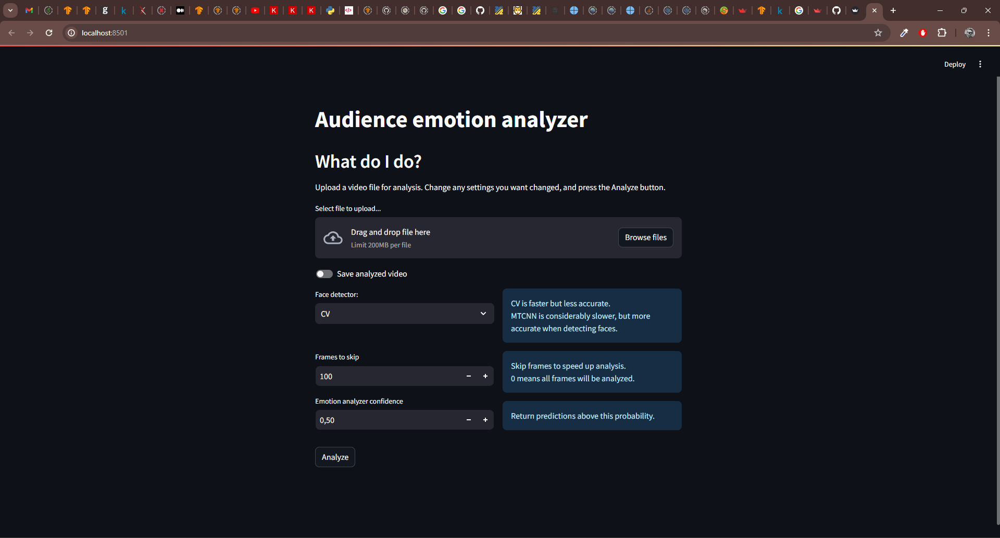

EC Utbildning | Data Scientist 2023 | Deep Learning | Kunskapskontroll 2

# Audience Emotion Analyzer

The Audience Emotion Analyzer analyzes a video and tries to detect faces in a crowd, predict the emotion of each face and creates a report in pdf format.

## Files
`facial-expression-recognition-using-cnn.ipynb` is the Jupyter Notebook where the emotion detector is trained.

`download_images.sh` is a bash script to download the training and validation data.

`app.py`is a `streamlit` app (see screenshot) where a user can upload a video and have it analyzed.
